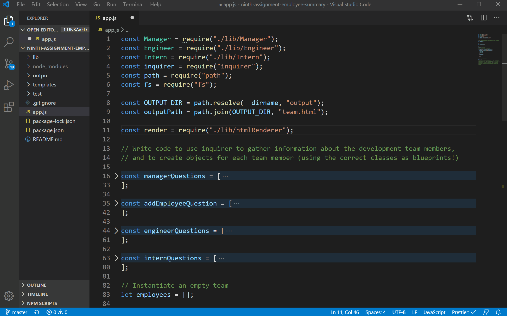

# Assignment 9: Team Page Builder

## A Node CLI tool to create a webpage summarizing the members of a software development team

- The tool prompts you for the manager's name, id, email, and office number.
- The tool then prompts you to add an intern, and engineer, or to finish
- Enginners have a unique github username field, while interns have a school field. All have name, id, and email.
- You may add an engineer or an intern, then repeat an arbitrary number of times to add as many team members as needed
- The tool creates an html page with a summary of the team, or updates an existing one if it already exists in the target directory
